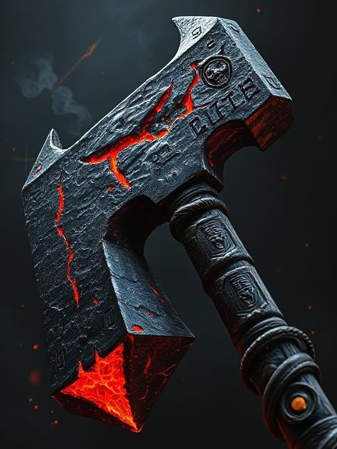

# Maul of Terror
<!-- 12,000 gp -->
Heavy - Two-Handed - 2d6 Bludgeoning

A massive, brutal maul with thats head is jagged, forged from blackened iron with glowing red cracks running through it. The shaft is thick, scorched wood wrapped in dark leather, etched with sinister runes that pulse faintly. Wisps of shadow and embers drift from the maul, and faint, ghostly faces seem to twist in torment along its surface. The weapon radiates an aura of fear and malevolence, ready to crush anything in its path.

**Topple**

If you hit a creature with this weapon, you can force the creature to make a Constitution saving throw (DC 8 plus the ability modifier used to make the attack roll and your Proficiency Bonus). On a failed save, the creature has the Prone condition.

**Terror** *(requires attunement)*

This magic weapon has 3 charges. While holding it, you can use an action and expend 1 charge to release a wave of terror. Each creature of your choice in a 30-foot radius extending from you must succeed on a DC 15 Wisdom saving throw or become frightened of you for 1 minute. While it is frightened in this way, a creature must spend its turns trying to move as far away from you as it can, and it can't willingly move to a space within 30 feet of you. It also can't take reactions. For its action, it can use only the Dash action or try to escape from an effect that prevents it from moving. If it has nowhere it can move, the creature can use the Dodge action. At the end of its turns, a creature can use the Dodge action. At the end of each of its turns, a creature can repeat the saving throw, ending the effect on itself on a success.

The maul regains 1d3 expended charges daily at dawn.