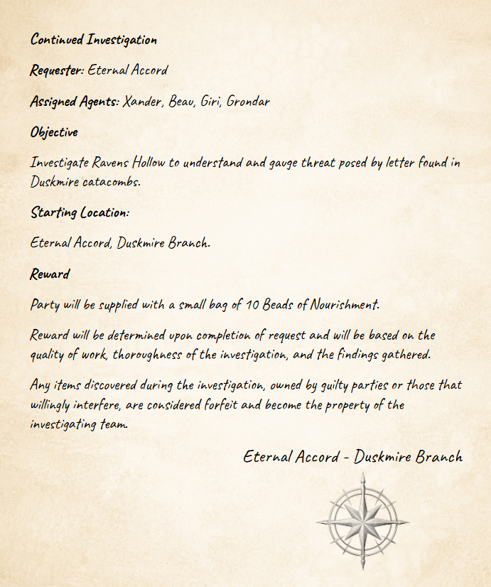

# Continued Investigation

---

**Requester**: Eternal Accord

**Assigned Agents**: Xander, Beau, Giri, Grondar

**Objective**

Investigate Ravens Hollow to understand and gauge threat posed by letter found in Duskmire catacombs.

**Starting Location**:

Eternal Accord, Duskmire branch.  

**Reward**

Party will be supplied with a small bag of 10 Beads of Nourishment.

Reward will be determined upon completion of request and will be based on the quality of work, thoroughness of the investigation, and the findings gathered.

Any items discovered during the investigation, owned by guilty parties or those that willingly interfere, are considered forfeit and become the property of the investigating team.