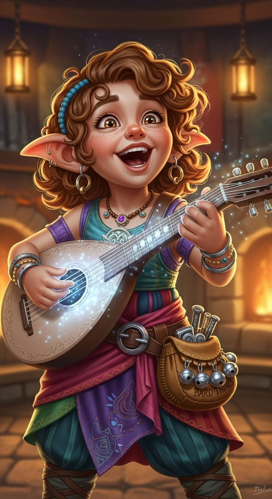
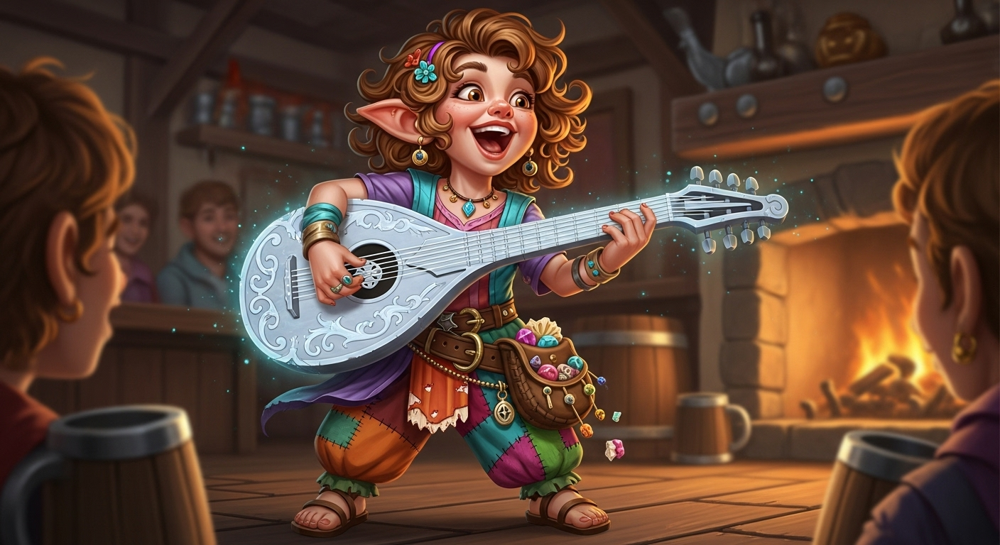

# Lira Valewynn

---

**Title**: Bard

**Race**: Lightfoot Halfling

**Age**: 21, 34, 55, or 89 depending on the story she is telling

**Ideals** *“The world’s too strange to be cynical, I’d rather believe in everything. - Herself”*

## Description

A sprightly Halfling bard no more than three feet tall with golden-brown curls and wide hazel eyes, is a whirlwind of song, stories, and boundless charm. Slightly gullible but endlessly endearing, she captivates taverns with her music and infectious laughter. Locals affectionately call her “Twinklestrings”, for the way her enchanted lute seems to shimmer with every note she plays.

Her clothes are a patchwork of colorful silks and glittering trinkets *(gifts from admirers and trophies from adventures she will happily tell you about)*. She carries her trusty lute, Silverchord, nearly as large as she is, and a belt pouch that jingles with mysterious “important bard things” *(mostly shiny rocks and half-eaten sweets)*.

