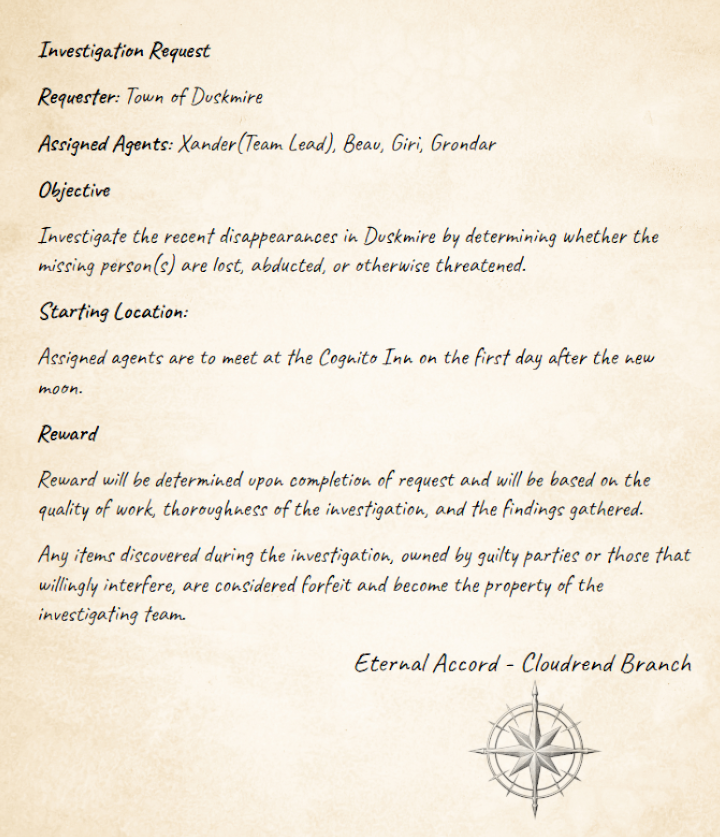

# Investigation Request

**Requester**: Town of Duskmire

**Assigned Agents**: Xander(Team Lead), Beau, Giri, Grondar

**Objective**

Investigate the recent disappearances in Duskmire by determining whether the missing person(s) are lost, abducted, or otherwise threatened.

**Starting Location**:

Assigned agents are to meet at the Cognito Inn on the first day after the new moon.

**Reward**

Reward will be determined upon completion of request and will be based on the quality of work, thoroughness of the investigation, and the findings gathered.

Any items discovered during the investigation, owned by guilty parties or those that willingly interfere, are considered forfeit and become the property of the investigating team.