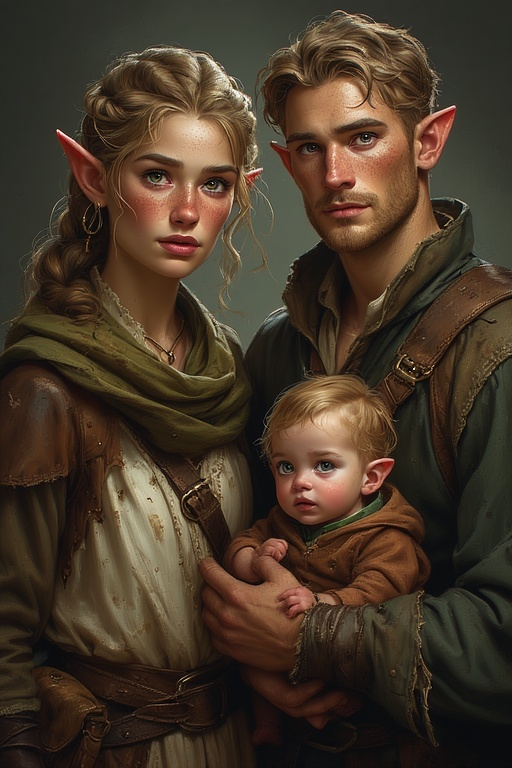

# Bramblefoot Family

---

## Lyria Bramblefoot

**Race**: Elf

**Age**: 47

## Description

Petite and delicate, with chestnut hair tied loosely behind her head, wide green eyes that dart constantly, and a faint build reflecting her young age.

## Tibbin Bramblefoot

**Race**: Elf

**Age**: 53

## Description

Slight and wiry, with sandy hair that curls at the ends, freckled cheeks, and large, anxious brown eyes. Wears tattered travel clothes, now dirty from confinement.

## Rowan Bramblefoot

**Race**: Elf

**Age**: 8 months

## Description

A baby elf with soft, fine hair, delicate features, and bright, curious eyes, usually held by their parents.