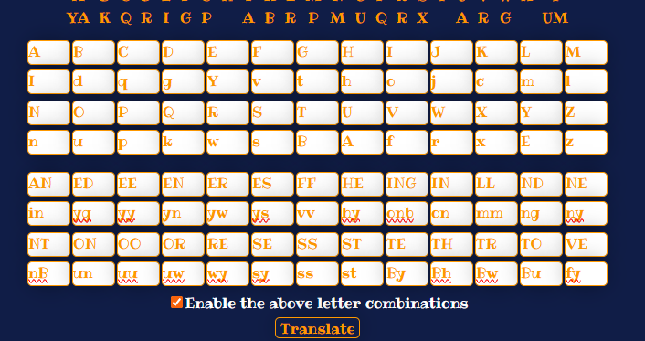
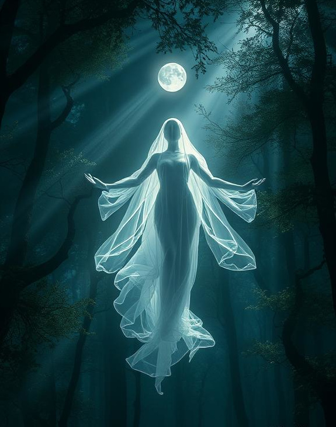

"Child of wandering shadow, do not tremble. I am the True Goddess, and I have walked since before the dawn of time."

"Qhomg uv ringywonb shigur, gu nub bwyldmy. O il bhy Bway Tuggyss, ing O hify rimcyg sonqy dyvuwy bhy girn uv boly."

*She tilts her head seeing your confusion then speaks again but this time in common*

"Forgive me, little one… it has been long since I last shaped words in your tongue." 

"The night has not claimed you, though it clings to your heart. Lift your gaze, my light is yours, and no darkness may bind you while I stand beside you. Rest, and let the weight of your grief fall into my hands."

"In moments of need, in hours of doubt, speak my name within your heart, and I shall hear. You are never beyond my reach, so long as you remember my name."

*She then fades away as quickly as she arrived but you could sense the power in her words deep within you even now*