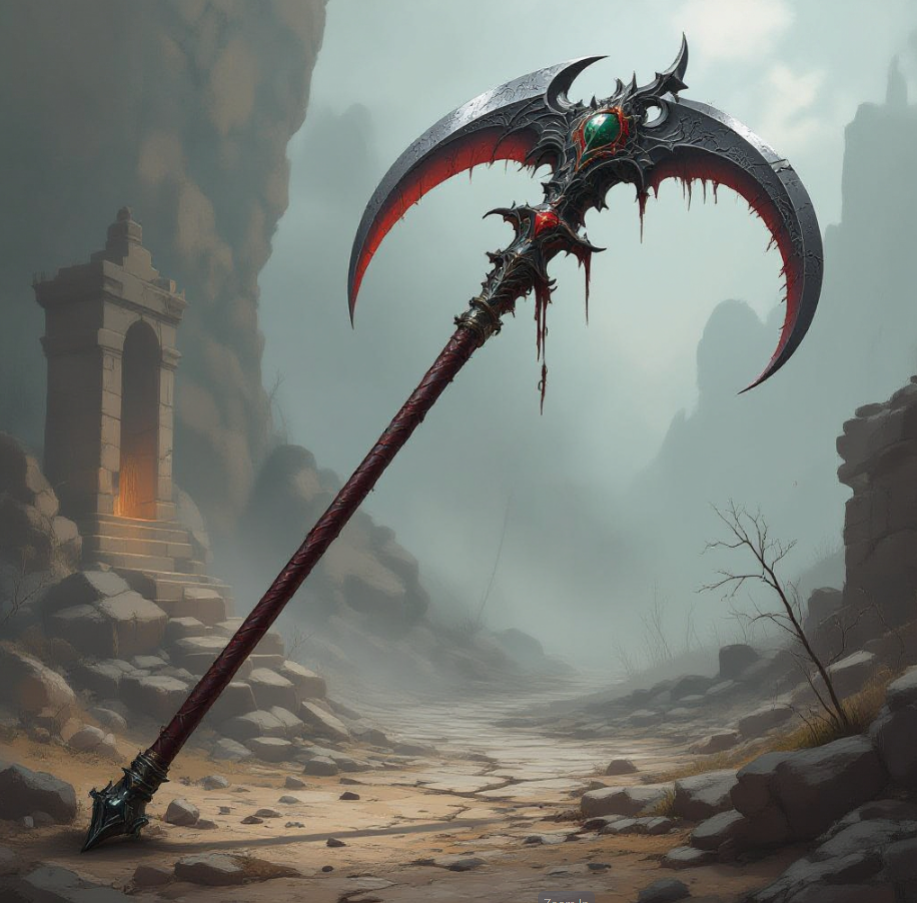

**Race**
Harengon
Mordenkainen Presents: Monsters of the Multiverse
https://dnd5e.wikidot.com/lineage:harengon

**Size** Medium

last name?
was the glaive a gift from ruby family?
Work for Eternal Accord or do jobs for them?

Eldritch Knight (Fighter)
    Abjuration(Divinity) & Evocation(Magocracy)

Fae Wilds or Endless Fog (Feywild Plane Origins)

Fey Syndicates
    Organization that exists on the Feywild Plane with power/influence on other planes

'Emerald' Porticulus
    - Father
    - Works for Magocracy but is one of few who don't live there
    - Emerald rank in Magocracy
    - Magocracy requires a 'stipend' to allow him to live outside city and keep rank

Zyla
    - Mother
    - Unable to concieve
    - Part of Fey Syndicates

Magocracy Connections
    - Ruby Family agreed to capture / kill Porticulus and co

# Glaive (cursed)

- returns after 45 minutes (maximum)
- 18th birthday (15 years ago)

**Heavy** - Small creatures have disadvantage on attack rolls with heavy weapons. A heavy weapon's size and bulk make it too large for a Small creature to use effectively.

**Reach** - This weapon adds 5 feet to your reach when you attack with it, as well as when determining your reach for opportunity attacks with it. 

**Two-Handed** - This weapon requires two hands when you attack with it. 

**Damage**: 1d10 - Slashing - Two-Handed

# Eternal Accord
Working there a few years, regularly sent on missions rather than having to go request/find them